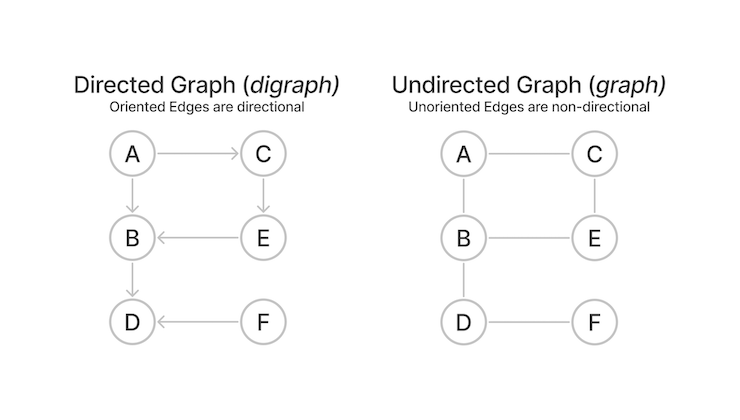
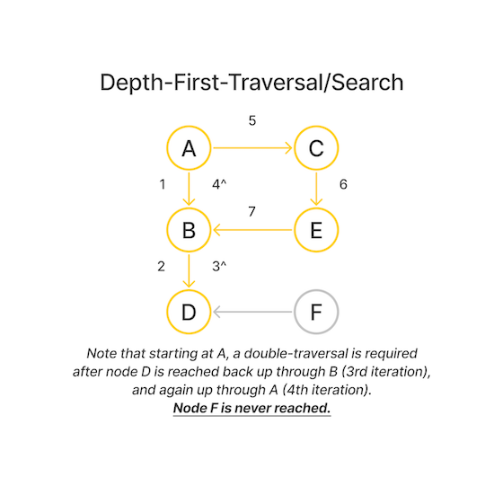

# Graph Algorithms for Technical Interviews - Full Course (Free Code Camp via structy.net)

## _Graph Basics_

#### Common Graph Types - Directed and Undirected



- Adjacency List _(progromatic implementation of above visualization. Usually an object in JS, a dictionary in Py, Unordered Map in C)_

```
directedGraph = {
    a: [b, c],
    b: [d],
    c: [e],
    d: [],
    e: [b],
    f: [d]
}
```

## _Traversal Algorithms_

#### **Depth First Traversal**

- Using our Directed Graph above
- A true depth-first traversal algorithm traverses **only adjacent** nodes in a depthward or _exhaustive-like_ fashion.
- If a dead-end node is encountered, a memory stack has to be used to pop-back-up till a node with an extant non-visited adjacent node is found.
  
