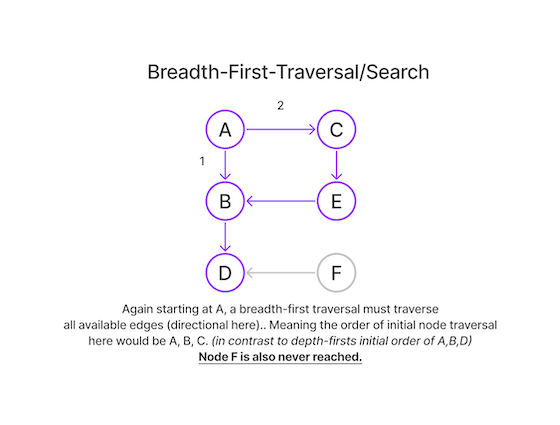

# Graph Algorithms for Technical Interviews - Full Course (Free Code Camp via structy.net)

## _Graph Basics_

#### Common Graph Types - Directed and Undirected


- Adjacency List _(progromatic implementation of above visualization. Usually an object in JS, a dictionary in Py, Unordered Map in C)_

```
directedGraph = {
    a: [b, c],
    b: [d],
    c: [e],
    d: [],
    e: [b],
    f: [d]
}
```

## _Traversal Algorithms_

#### **Depth First Traversal/Search**

- Using our Directed Graph above and starting at Node A, arbitrarily picking neighboring B as the next node to traverse..
- Using some information from [this great resource](https://www.tutorialspoint.com/data_structures_algorithms/depth_first_traversal.htm)
- A true depth-first traversal algorithm traverses nodes in a depthward or _exhaustive-like_ fashion.
- If a dead-end node is encountered, a memory stack has to be used to pop-back-up till a node with an extant non-visited adjacent node is found.
  

#### **Breadth First Traversal/Search**

- Using our Directed Graph above and starting at Node A, arbitrarily picking neighboring B as the next node to traverse..
- Using some information from [this great resource](https://www.tutorialspoint.com/data_structures_algorithms/breadth_first_traversal.htm)
- A true breadth-first traversal algorithm traverses **only adjacent** nodes in a breadthward or all-edge-from-node fashion.
- If a dead-end node is encountered, a queue (in contrast to the stack used in DFS) has to be used. F in our illustration is still never reached due to the directional edges.
  

### **Diffing DFT vs BFT**

- A DFT will want to _'drill-down-in-one-direction'_ in an exhaustive **one direction** manner, only when that direction runs out will it pick and exhaustively traverse a different direction. Think of those snake-games where a key input changes the snake, which then continues in that direction till it impacts a 'wall'.
- A DFT utilizes a memory **stack**
- On the other hand visualizing a BFT, starting from the same node you would then spread outward from that starting node **in all directions** utilizing every edge off of that initial node.
- A BFT utilizes a **queue**
- [Great resource on stacks and queues](<https://everythingcomputerscience.com/discrete_mathematics/Stacks_and_Queues.html#:~:text=Stack%20is%20a%20container%20of,%2Dout%20(FIFO)%20principle.>)
- A useful way of thinking about a stack is to picture a vertical structure where new elements come in and exit from the top. **LIFO**
- Similarly helpful is picturing a queue as a horizontal list-like structure where new elements come in from the left and exit from the right **FIFO**

## **Deterining Space and Time Complexity of Graph Algorithms**


